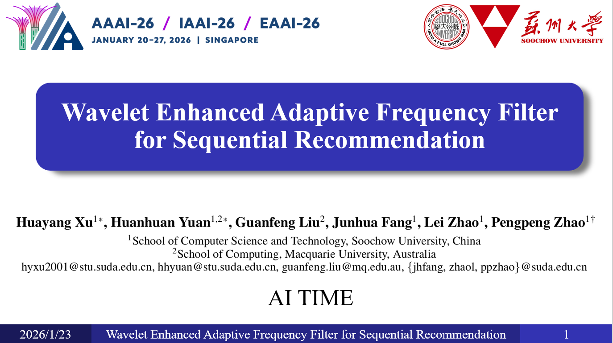
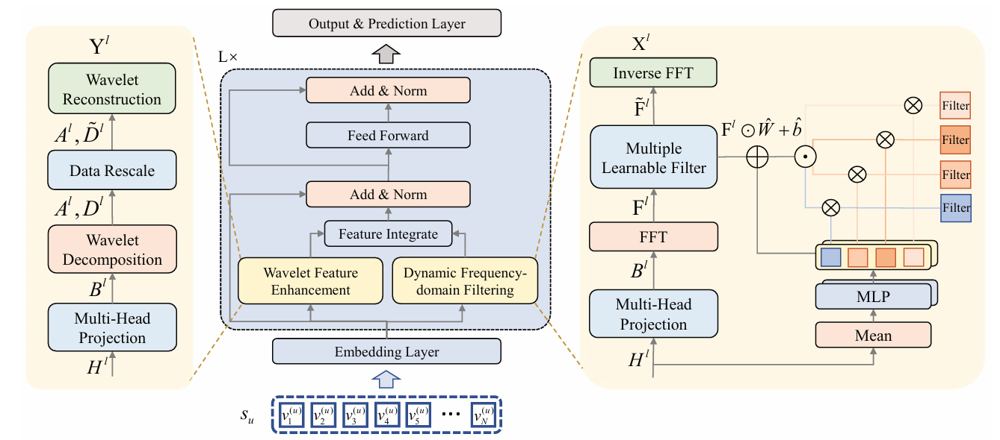

# WEARec
This is the official source code for our AAAI 2026 Paper (Oral Presentation) ["Wavelet Enhanced Adaptive Frequency Filter for Sequential Recommendation"](https://arxiv.org/abs/2511.07028)

## Related Materials
### 📺 Tutorials & Blog
We provide a video presentation and a detailed blog post (in Chinese) to help you better understand the core idea of WEARec.

| **Video Presentation** | **WeChat Blog** |
| :---: | :---: |
| [](https://www.bilibili.com/video/BV1BSzsBYEGT/?share_source=copy_web&vd_source=bd32781331d243868263515bf1605450&t=3659) <br> <a href="https://www.bilibili.com/video/BV1BSzsBYEGT/?share_source=copy_web&vd_source=bd32781331d243868263515bf1605450&t=3659"></a> | [](https://mp.weixin.qq.com/s/bj4x3tC8BWuPmBhAq5aREQ) <br> <a href="https://mp.weixin.qq.com/s/bj4x3tC8BWuPmBhAq5aREQ"></a> |
### 💡 Video & Slides & Poster
We offer an English video tutorial, the conference poster, and presentation slides to help you better understand the core idea of WEARec.
Download Links: [Google Drive](https://drive.google.com/drive/folders/1oFiXopeBDUW6JagoWIfal14hC214UrVW?usp=sharing) | [Baidu Netdisk](https://pan.baidu.com/s/1D9V_FhRmAHRJYX0HyLQ9Mw?pwd=6666)
## Long-Sequence Experiment Results Update
We noticed that [TVRec](https://arxiv.org/abs/2510.25259) (NeurIPS 2025) conducted experiments on the FourSquare dataset to test performance in long-sequence settings ($N=200$). In response, we provide the corresponding performance benchmarks for WEARec here.


<table>
  <tr>
    <th rowspan="2">Metric</th>
    <th colspan="2">ML-1M</th>
    <th colspan="2">LastFM</th>
    <th colspan="2">FourSquare</th>
  </tr>
  <tr>
    <th>Ours</th>
    <th>TVRec</th>
    <th>Ours</th>
    <th>TVRec</th>
    <th>Ours</th>
    <th>TVRec</th>
  </tr>
  <tr>
    <td>HR@5</td>
    <td>0.2321</td>
    <td>0.2255</td>
    <td>0.0661</td>
    <td style="text-align: center;">——</td>
    <td>0.0194</td>
    <td>0.0148</td>
  </tr>
  <tr>
    <td>HR@10</td>
    <td>0.3334</td>
    <td>0.3232</td>
    <td>0.0972</td>
    <td style="text-align: center;">——</td>
    <td>0.0231</td>
    <td>0.0212</td>
  </tr>
   <tr>
    <td>HR@20</td>
    <td>0.4421</td>
    <td>0.4306</td>
    <td>0.1477</td>
    <td style="text-align: center;">——</td>
    <td>0.0342</td>
    <td>0.0323</td>
  </tr>
  <tr>
    <td>NDCG@5</td>
    <td>0.1577</td>
    <td>0.1572</td>
    <td>0.0456</td>
    <td style="text-align: center;">——</td>
    <td>0.0148</td>
    <td>0.0108</td>
  </tr>
  <tr>
    <td>NDCG@10</td>
    <td>0.1904</td>
    <td>0.1886</td>
    <td>0.0556</td>
    <td style="text-align: center;">——</td>
    <td>0.0160</td>
    <td>0.0129</td>
  </tr>
  <tr>
    <td>NDCG@20</td>
    <td>0.2179</td>
    <td>0.2157</td>
    <td>0.0682</td>
    <td style="text-align: center;">——</td>
    <td>0.0188</td>
    <td>0.0158</td>
  </tr>
</table>

## Overview
The model architecture of WEARec is similar to the transformer encoder. It first generates item embedding with positional embedding through the embedding layer , and then extracts user preference from the frequency domain by replacing the self-attention module with the wavelet feature enhancement module and dynamic frequency-domain filtering module. Their details are shown on both sides. Finally, a prediction layer computes a recommendation score for all candidate items.


## 
## Dataset
In our experiments, we utilize four datasets, all stored in the `src/data` folder. Given the limited space for uploaded files, we have only uploaded one dataset, LastFM, as an example.
- The `src/data/*_same_target.npy` files are utilized for training contrastive learning baselines (DuoRec, SLIME4Rec, and FEARec).
  
## Quick Start
### Environment Setting
```
conda env create -f wearec_env.yaml
conda activate wearec
```

### How to train WEARec
- Note that pretrained model (.pt) and train log file (.log) will saved in `src/output`
- `train_name`: name for log file and checkpoint file
```
python main.py  --data_name [DATASET] \
                --lr [LEARNING_RATE] \
                --alpha [ALPHA] \ 
                --num_heads [N_HEADS] \
                --train_name [LOG_NAME]
```
- Example for LastFM
```
python main.py  --data_name LastFM \
                --lr 0.001 \
                --alpha 0.3 \
                --num_heads 2 \
                --train_name WEARec_LastFM
```

### How to test pretrained WEARec
- Note that pretrained model (.pt file) must be in `src/output`
- `load_model`: pretrained model name without .pt
```
python main.py  --data_name [DATASET] \
                --lr [LEARNING_RATE] \
                --alpha [ALPHA] \ 
                --num_heads [N_HEADS] \
                --load_model [LOG_NAME] \
                --do_eval
```
- Example for LastFM
```
python main.py  --data_name LastFM \
                --lr 0.001 \
                --alpha 0.3 \
                --num_heads 2 \
                --load_model WEARec_K_50_LastFM_0.5_0.001_0.3_2 \
                --do_eval
```

### How to train the baselines
- You can easily train the baseline models used in WEARec by changing the `model_type` argument.
    - `model_type`: Caser, GRU4Rec, SASRec, BERT4Rec, FMLPRec, DuoRec, SLIME4Rec, FEARec, BSARec
- For the hyperparameters for the baselines, check the `parse_args()` function in `src/utils.py`.
```
python main.py  --model_type SASRec \
                --data_name LastFM \
                --num_attention_heads 1 \
                --train_name SASRec_LastFM
```

## Citation
If you find our work useful, please consider citing our paper:
```
@misc{xu2025waveletenhancedadaptivefrequency,
      title={Wavelet Enhanced Adaptive Frequency Filter for Sequential Recommendation}, 
      author={Huayang Xu and Huanhuan Yuan and Guanfeng Liu and Junhua Fang and Lei Zhao and Pengpeng Zhao},
      year={2025},
      eprint={2511.07028},
      archivePrefix={arXiv},
      primaryClass={cs.IR},
      url={https://arxiv.org/abs/2511.07028}, 
}
```

## Contact
If you have any inquiries regarding our paper or codes, feel free to reach out via email at xuhuayang2001@163.com.

## Acknowledgement
This repository is based on [BSARec](https://github.com/yehjin-shin/BSARec).

<div align="center">
<p>⭐ Star this repository if you find it helpful!</p>
</div>
