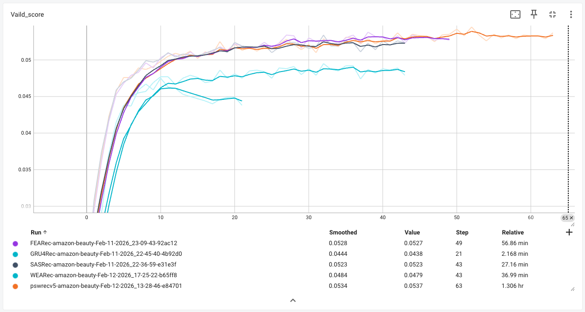
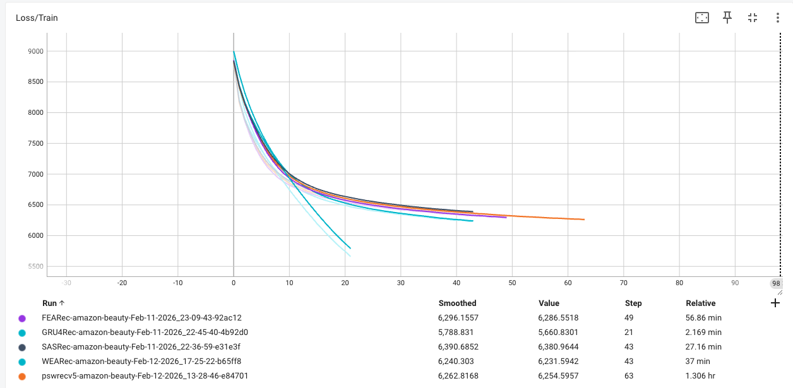

# Amazon Beauty Benchmark Results

## Summary (Params, @10 and @20 metrics)

| Metric | GRU4Rec | SASRec | FEARec | WEARec | PSWRec | PSWRecV5 | Improvement% |
|--------|---------|--------|--------|--------|--------|----------|--------------|
| Params | 856,512 | 877,824 | 877,824 | 910,976 | 885,012 | 885,014 | N/A          |
| Hit@10 | 0.0623 | 0.0842 | 0.0854* | 0.0814 | 0.0853 | **0.0863** | +1.1%       |
| Hit@20 | 0.0922 | 0.1193 | 0.1208* | 0.1192 | 0.1182 | **0.1225** | +1.4%       |
| NDCG@10 | 0.0342 | 0.0421 | 0.0433* | 0.0395 | 0.0428 | **0.0441** | +1.8%       |
| NDCG@20 | 0.0417 | 0.0510 | 0.0522* | 0.0491 | 0.0511 | **0.0531** | +1.7%       |
| MRR@10 | 0.0256 | 0.0292 | 0.0304* | 0.0268 | 0.0298 | **0.0311** | +2.3%       |
| MRR@20 | 0.0277 | 0.0316 | 0.0328* | 0.0294 | 0.0321 | **0.0336** | +2.4%       |

**Note:** Test scores at best validation epoch only. Valid metric: NDCG@10, stopping_step: 10.

## Full results (all metrics)

| Metric | GRU4Rec | SASRec | FEARec | WEARec | PSWRec | PSWRecV5 | Improvement% |
|--------|---------|--------|--------|--------|--------|----------|--------------|
| Params | 856,512 | 877,824 | 877,824 | 910,976 | 885,012 | 885,014 | N/A          |
| Hit@1 | **0.0135** | 0.0090 | 0.0102 | 0.0083 | 0.0095 | 0.0112* | -17.0%      |
| Hit@5 | 0.0414 | 0.0556 | **0.0573** | 0.0504 | 0.0546 | 0.0571* | -0.3%       |
| Hit@10 | 0.0623 | 0.0842 | 0.0854* | 0.0814 | 0.0853 | **0.0863** | +1.1%       |
| Hit@20 | 0.0922 | 0.1193 | 0.1208* | 0.1192 | 0.1182 | **0.1225** | +1.4%       |
| NDCG@1 | **0.0135** | 0.0090 | 0.0102 | 0.0083 | 0.0095 | 0.0112* | -17.0%      |
| NDCG@5 | 0.0274 | 0.0329 | 0.0343* | 0.0295 | 0.0329 | **0.0346** | +0.9%       |
| NDCG@10 | 0.0342 | 0.0421 | 0.0433* | 0.0395 | 0.0428 | **0.0441** | +1.8%       |
| NDCG@20 | 0.0417 | 0.0510 | 0.0522* | 0.0491 | 0.0511 | **0.0531** | +1.7%       |
| MRR@1 | **0.0135** | 0.0090 | 0.0102 | 0.0083 | 0.0095 | 0.0112* | -17.0%      |
| MRR@5 | 0.0229 | 0.0254 | 0.0267* | 0.0227 | 0.0257 | **0.0273** | +2.2%       |
| MRR@10 | 0.0256 | 0.0292 | 0.0304* | 0.0268 | 0.0298 | **0.0311** | +2.3%       |
| MRR@20 | 0.0277 | 0.0316 | 0.0328* | 0.0294 | 0.0321 | **0.0336** | +2.4%       |

**Bold** = best, * = second best.

## Training curves

