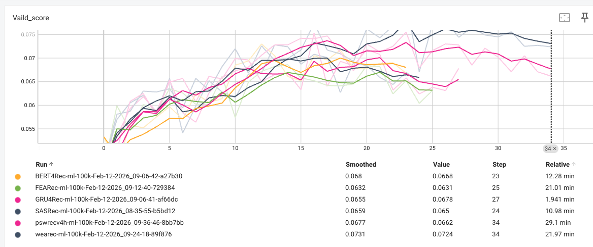
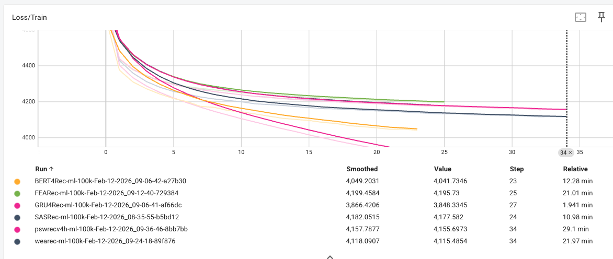

# MovieLens 100K Benchmark Results

## Summary (Params, @10 and @20 metrics)

| Metric | GRU4Rec | SASRec | FEARec | WEARec (official) | PSWRec | PSWRecV5 |
|--------|---------|--------|--------|-------------------|--------|----------|
| Params | 168,384 | 189,696 | 189,696 | 181,666 | 196,884 | 196,886 |
| Hit@10 | 0.1304* | 0.1198 | 0.1304* | **0.1930** | 0.1251 | 0.1304* |
| Hit@20 | 0.2259 | 0.2185 | 0.2110 | **0.2959** | 0.2344 | 0.2397* |
| NDCG@10 | 0.0650* | 0.0594 | 0.0622 | **0.1023** | 0.0613 | 0.0635 |
| NDCG@20 | 0.0891 | 0.0844 | 0.0824 | **0.1280** | 0.0888 | 0.0908* |
| MRR@10 | **0.0453** | 0.0412 | 0.0418 | — | 0.0419 | 0.0435* |
| MRR@20 | **0.0518** | 0.0481 | 0.0472 | — | 0.0494 | 0.0508* |

**Note:** Test scores at best validation epoch only. WEARec (official repo on TRACT data) reports HR/NDCG only; MRR not computed. All models early-stop on NDCG@10; stopping_step: 10.

## Full results (all metrics)

Metrics in rows, models in columns.

| Metric | GRU4Rec | SASRec | FEARec | WEARec (official) | PSWRec | PSWRecV5 |
|--------|---------|--------|--------|-------------------|--------|----------|
| Params | 168,384 | 189,696 | 189,696 | 181,666 | 196,884 | 196,886 |
| Hit@1 | 0.0170* | **0.0180** | 0.0159 | — | 0.0127 | **0.0180** |
| Hit@5 | 0.0806* | 0.0647 | 0.0700 | **0.1230** | 0.0774 | 0.0732 |
| Hit@10 | 0.1304* | 0.1198 | 0.1304* | **0.1930** | 0.1251 | 0.1304* |
| Hit@20 | 0.2259 | 0.2185 | 0.2110 | **0.2959** | 0.2344 | 0.2397* |
| NDCG@1 | 0.0170* | **0.0180** | 0.0159 | — | 0.0127 | **0.0180** |
| NDCG@5 | 0.0493* | 0.0413 | 0.0426 | **0.0799** | 0.0462 | 0.0453 |
| NDCG@10 | 0.0650* | 0.0594 | 0.0622 | **0.1023** | 0.0613 | 0.0635 |
| NDCG@20 | 0.0891 | 0.0844 | 0.0824 | **0.1280** | 0.0888 | 0.0908* |
| MRR@1 | 0.0170* | **0.0180** | 0.0159 | — | 0.0127 | **0.0180** |
| MRR@5 | **0.0390** | 0.0336 | 0.0337 | — | 0.0359* | 0.0362 |
| MRR@10 | **0.0453** | 0.0412 | 0.0418 | — | 0.0419 | 0.0435* |
| MRR@20 | **0.0518** | 0.0481 | 0.0472 | — | 0.0494 | 0.0508* |

**Bold** = best, * = second best. WEARec (official repo on TRACT data) reports HR/NDCG only; — = not reported.

## Training curves

